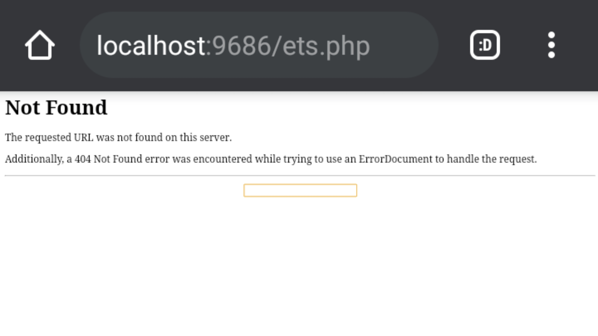

# Evil Twin Shell

**Coder Eval ID A.K.A Fadly31337**
**Encrypter Sec666 A.K.A ZSec**

## Feature :
 
 

 
 
 
 
- Protection password with md5
- Bypass Disable Functions
- Bypass Symlink Vhost
- Info System
- Command Line
- Symlink
- Symlink 403
- Symlink 404
- Jumping
- Auto Edit User
- Grab Config
- Domains
- Mass Deface
- Mass Delete
- Smtp Grabber
- Submit Mirror Zone-H
- Can edit,upload,delete,rename,change permissions a file
- Rename,delete folder

### Special Feature

- incognito Login Page With Display Error 404 Not Found
 

 
- Size very mini but many feature just 2kb
- You can use the latest shell without having to download it again , example we update v2.0 you can use live if your shell actived (why ? is secret)

#### Note

- This shell no logger , we promise
- We not responsible for the actions you have done with this shell.
- And Enjoy This Shell

##### Thanks For

- Con7ext
- JombangXploiter

###### Version

V1.0 ( Beta )

{ https://github.com/eviltwin-dev/eviltwin-shell/ }
